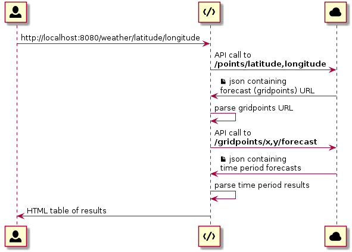

# About

This is a simple experiment, to wrap my mind around how [Spring WebFlux](https://docs.spring.io/spring-framework/docs/current/spring-framework-reference/web-reactive.html#spring-webflux) works, loosely based on [this guide](https://spring.io/guides/gs/reactive-rest-service/) and [corresponding repo](https://github.com/spring-guides/gs-reactive-rest-service).

## How's the weather?

Rather than just a simple `"Hello, Spring!"` echo, this project uses the [weather.gov API](https://www.weather.gov/documentation/services-web-api) to respond to [latitude and longitude](https://en.wikipedia.org/wiki/Geographic_coordinate_system#Latitude_and_longitude) pairs with the corresponding 7-day forecast.

The [WebClient](https://docs.spring.io/spring-framework/docs/current/javadoc-api/org/springframework/web/reactive/function/client/WebClient.html) is used to translate the `(latitude,longitude)` pair into a grid address from which the actual forecast can be found.

This requires a pair of API calls chained together, both of which are non-blocking:



# Usage

## Build and Run

To build and run this project from scratch, install both [Java](https://www.java.com/) and [Gradle](https://gradle.org/) via [SDKMAN!](https://sdkman.io):

```sh
sdk install java 11.0.3.hs-adpt
sdk install gradle 6.2.2
```

This enables you to build and run the server from the command line:

```sh
./gradlew clean build
./gradlew bootRun

> Task :bootRun

  .   ____          _            __ _ _
 /\\ / ___'_ __ _ _(_)_ __  __ _ \ \ \ \
( ( )\___ | '_ | '_| | '_ \/ _` | \ \ \ \
 \\/  ___)| |_)| | | | | || (_| |  ) ) ) )
  '  |____| .__|_| |_|_| |_\__, | / / / /
 =========|_|==============|___/=/_/_/_/
 :: Spring Boot ::        (v2.2.5.RELEASE)

2020-03-15 12:07:51.908  INFO 13318 --- [           main] o.papathanasiou.denis.ServerApplication  : Starting ServerApplication on localhost with PID 13318 (/.../spring-webflux/build/classes/java/main started by denis in /.../spring-webflux)
2020-03-15 12:07:51.913  INFO 13318 --- [           main] o.papathanasiou.denis.ServerApplication  : No active profile set, falling back to default profiles: default
2020-03-15 12:07:53.768  INFO 13318 --- [           main] o.s.b.web.embedded.netty.NettyWebServer  : Netty started on port(s): 8080
2020-03-15 12:07:53.778  INFO 13318 --- [           main] o.papathanasiou.denis.ServerApplication  : Started ServerApplication in 2.439 seconds (JVM running for 2.922)
```

Alternatively, you can just use [IntelliJ IDEA](https://www.jetbrains.com/idea/), and turn on the [ServerApplication](.idea/runConfigurations/ServerApplication.xml) [run configuration](https://www.jetbrains.com/help/idea/run-debug-configurations-dialog.html).

## Making Requests

Use [curl](https://curl.haxx.se/) or open a web browser and visit `http://localhost:8080/weather/{latitude}/{longitude}`.

For example, `http://localhost:8080/weather/40.7688/-73.9898` on March 15, 2020 resulted in:

|Time Period|Forecast|
|-----------|--------|
|Today|Sunny. High near 52, with temperatures falling to around 49 in the afternoon. North wind around 8 mph.|
|Tonight|Mostly clear, with a low around 33. Northeast wind around 8 mph.|
|Monday|Mostly sunny, with a high near 45. East wind around 10 mph.|
|Monday Night|A chance of rain showers after 9pm. Mostly cloudy, with a low around 39. Southeast wind 7 to 10 mph. Chance of precipitation is 40%.|
|Tuesday|A chance of rain showers. Mostly cloudy, with a high near 56. South wind around 9 mph, with gusts as high as 21 mph. Chance of precipitation is 50%.|
|Tuesday Night|A slight chance of rain showers before midnight. Partly cloudy, with a low around 36.|
|Wednesday|Sunny, with a high near 48.|
|Wednesday Night|A slight chance of snow showers after midnight. Partly cloudy, with a low around 36.|
|Thursday|A chance of snow showers before 9am, then a chance of rain and snow showers. Mostly cloudy, with a high near 51. Chance of precipitation is 50%.|
|Thursday Night|A chance of rain showers. Mostly cloudy, with a low around 46. Chance of precipitation is 50%.|
|Friday|A chance of rain showers. Cloudy, with a high near 66. Chance of precipitation is 50%.|
|Friday Night|A chance of rain showers. Mostly cloudy, with a low around 45. Chance of precipitation is 40%.|
|Saturday|A chance of rain showers. Partly sunny, with a high near 51. Chance of precipitation is 30%.|
|Saturday Night|A slight chance of snow showers. Partly cloudy, with a low around 29.|

# Acknowledgements

* [The introduction to Reactive Programming you've been missing](https://gist.github.com/staltz/868e7e9bc2a7b8c1f754)
* [Writing tests for Spring WebClient with MockWebServer](https://codingtim.github.io/webclient-testing/)
* [Correcting the `mockwebserver` version incompatibility with `okhttp`](https://github.com/square/okhttp/issues/5379#issuecomment-577573283)
